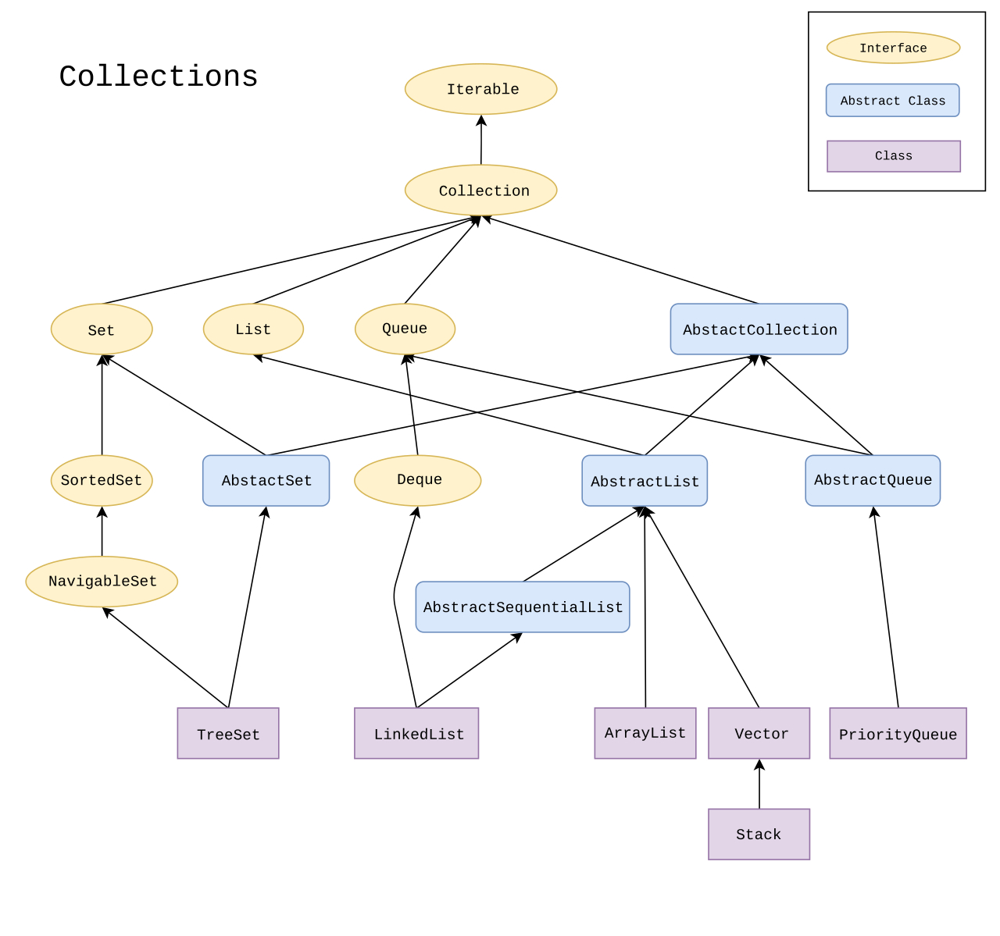

# Java Collection Framework (JCF)

# JCF Hierarchy



# Interfaces in Collection

- Collection
  This Collection interface is at the top of the hierarchy.
- List
  List extends from Collection interface it helps you to work with sequences or lists. 
- Queue
  Queue extends from Collection interface it helps you to work with a special kind of list where elements are removed and added from different end.
- Dqueue
  Dqueue extends from Queue it helps to work with double-ended queue.
- Set
  Set extends from Collection it works with a special data structure that can not have duplicate elements.
- SortedSet
  SortedSet extends from Set it handles set that are sorted in order.
- NavigableSet
  NavigaleSet extends from SortedSet to handle retrival of element based on closest match.

# Collection Interface

Collection interface is Generic type means it can work with any type of objects.

```
interface Collection<T> {
}
```

It consists of so many methods like-

- boolean add(T obj)
  This method helps to add an object into any collection. It will return `true`if the object is added successfully, return `false` if object is already added and the collection does not support to have duplicates.
- boolean addAll(Collection<? extends T> c)
